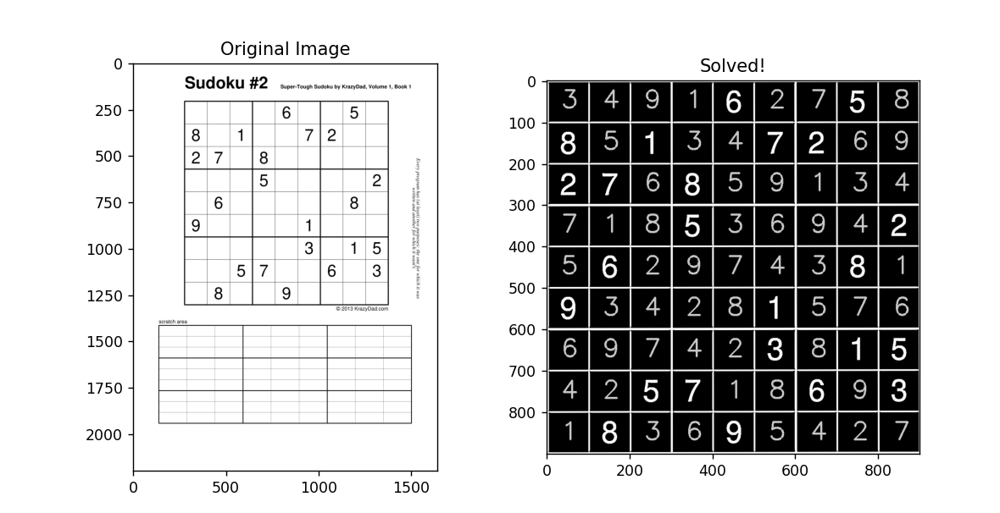

# Sudoku Solver

This repository contains a Sudoku solver implemented using backtracking and OpenCV for image analysis.

## Features

- **Backtracking Algorithm:** The solver uses the backtracking algorithm to find the solution to Sudoku puzzles.
- **Image Analysis with OpenCV:** It includes functionality to analyze Sudoku puzzles from images using OpenCV.



## How to Use

### Running the Solver

To run the Sudoku solver:

1. Clone the repository to your local machine.
2. Navigate to the project directory.
3. Run the solver script.

```bash
python main.py
